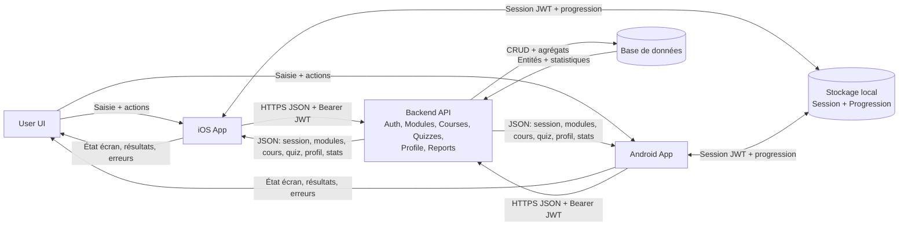

# Architecture

## Tableau d'architecture

| Source | Destination | Données échangées | Format | Sécurité |
|---|---|---|---|---|
| User UI | iOS / Android | Actions utilisateur: connexion, inscription, lancement cours, réponses quiz, édition profil, export rapport | Événements UI | Validation côté client |
| iOS / Android | User UI | États d'interface: chargement, succès, erreurs, progression, résultats quiz, statistiques | État local (state) | Messages d'erreur contrôlés |
| iOS / Android | Backend | POST /auth/login: email, password | JSON | HTTPS + validation du payload |
| iOS / Android | Backend | POST /auth/register: email, password, fullName | JSON | HTTPS + règles mot de passe |
| iOS / Android | Backend | GET /modules | JSON | HTTPS |
| iOS / Android | Backend | GET /courses/:courseCode | JSON | HTTPS |
| iOS / Android | Backend | GET /quizzes/:quizCode | JSON | HTTPS |
| iOS / Android | Backend | POST /quizzes/:quizCode/submit: answers | JSON | HTTPS + Bearer JWT |
| iOS / Android | Backend | GET /profile/me | JSON | HTTPS + Bearer JWT |
| iOS / Android | Backend | PUT /profile/me: fullName, role, organization | JSON | HTTPS + Bearer JWT |
| iOS / Android | Backend | GET /reports/export?format&period | Query + JSON | HTTPS + Bearer JWT |
| Backend | iOS / Android | Session: token + user | JSON | JWT signé + expiration |
| Backend | iOS / Android | Catalogue: modules, cours, quiz, questions | JSON | Contrôle d'accès |
| Backend | iOS / Android | Résultat quiz: attemptId, score, total, successRate | JSON | Intégrité calculée côté serveur |
| Backend | iOS / Android | Profil: email, fullName, role, organization | JSON | Données filtrées |
| Backend | Base de données | CRUD users/modules/courses/quizzes/questions | SQL/ORM | Connexion DB sécurisée |
| Backend | Base de données | Insert quiz_attempt, quiz_answer | SQL/ORM | Transactions |
| Backend | Base de données | Agrégats statistiques (attempts, averageSuccessRate) | SQL/ORM | Requêtes agrégées contrôlées |
| Base de données | Backend | Entités métier + statistiques | Objets ORM | Contraintes + index |

Bearer : Mode d'authentification par jeton
ORM : Communication entre la base de données SQLLite et le backend assurée par Prisma (Node.js / TypeScript)

## Explication de l'architecture

Cette architecture suit un modèle client-serveur en 4 blocs: interface utilisateur, applications mobiles, backend API et base de données.

1. User UI
- L'utilisateur interagit avec les écrans d'authentification, de modules, de cours, de quiz et de profil.
- Les actions déclenchent des événements UI (connexion, réponse quiz, modification du profil, demande de rapport).

2. Applications iOS et Android
- Les deux applications utilisent la même logique métier côté mobile.
- Elles pilotent la navigation, affichent les états (chargement, succès, erreur) et appellent le backend via des requêtes HTTPS JSON.
- Elles stockent localement la session JWT et la progression d'apprentissage via le stockage local (AsyncStorage).

3. Backend API
- Le backend centralise les règles métier: authentification, récupération du catalogue pédagogique, correction des quiz, gestion du profil et génération de statistiques.
- Les endpoints protégés utilisent un token Bearer JWT pour autoriser les opérations utilisateur.

4. Base de données
- La base conserve les données persistantes: utilisateurs, modules, cours, quiz, questions et tentatives.
- Le backend y effectue des opérations CRUD et des agrégations pour construire les rapports (nombre de tentatives, taux de réussite moyen).

### Cycle de données principal

- Connexion: l'app envoie email/mot de passe au backend, reçoit un JWT, puis sauvegarde la session localement.
- Apprentissage: l'app charge modules/cours/quiz depuis l'API et met à jour la progression locale.
- Évaluation: les réponses quiz sont envoyées au backend, qui calcule score et taux de réussite puis renvoie le résultat.
- Profil et reporting: l'app récupère/modifie le profil et demande des statistiques exportables.

## Schéma d'architecture

