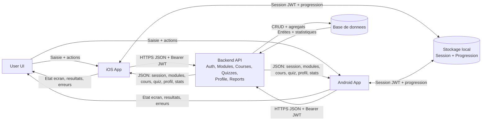

# Architecture

## Tableau d'architecture

| Source | Destination | Donnees echangees | Format | Securite |
|---|---|---|---|---|
| User UI | iOS / Android | Actions utilisateur: connexion, inscription, lancement cours, reponses quiz, edition profil, export rapport | Evenements UI | Validation cote client |
| iOS / Android | User UI | Etats d'interface: chargement, succes, erreurs, progression, resultats quiz, statistiques | Etat local (state) | Messages d'erreur controles |
| iOS / Android | Backend | POST /auth/login: email, password | JSON | HTTPS + validation payload |
| iOS / Android | Backend | POST /auth/register: email, password, fullName | JSON | HTTPS + regles mot de passe |
| iOS / Android | Backend | GET /modules | JSON | HTTPS |
| iOS / Android | Backend | GET /courses/:courseCode | JSON | HTTPS |
| iOS / Android | Backend | GET /quizzes/:quizCode | JSON | HTTPS |
| iOS / Android | Backend | POST /quizzes/:quizCode/submit: answers | JSON | HTTPS + Bearer JWT |
| iOS / Android | Backend | GET /profile/me | JSON | HTTPS + Bearer JWT |
| iOS / Android | Backend | PUT /profile/me: fullName, role, organization | JSON | HTTPS + Bearer JWT |
| iOS / Android | Backend | GET /reports/export?format&period | Query + JSON | HTTPS + Bearer JWT |
| Backend | iOS / Android | Session: token + user | JSON | JWT signe + expiration |
| Backend | iOS / Android | Catalogue: modules, cours, quiz, questions | JSON | Controle d'acces |
| Backend | iOS / Android | Resultat quiz: attemptId, score, total, successRate | JSON | Integrite calculee cote serveur |
| Backend | iOS / Android | Profil: email, fullName, role, organization | JSON | Donnees filtrees |
| Backend | Base de donnees | CRUD users/modules/courses/quizzes/questions | SQL/ORM | Connexion DB securisee |
| Backend | Base de donnees | Insert quiz_attempt, quiz_answer | SQL/ORM | Transactions |
| Backend | Base de donnees | Agregats statistiques (attempts, averageSuccessRate) | SQL/ORM | Requetes agregees controlees |
| Base de donnees | Backend | Entites metier + statistiques | Objets ORM | Contraintes + index |

## Diagramme Mermaid enrichi

